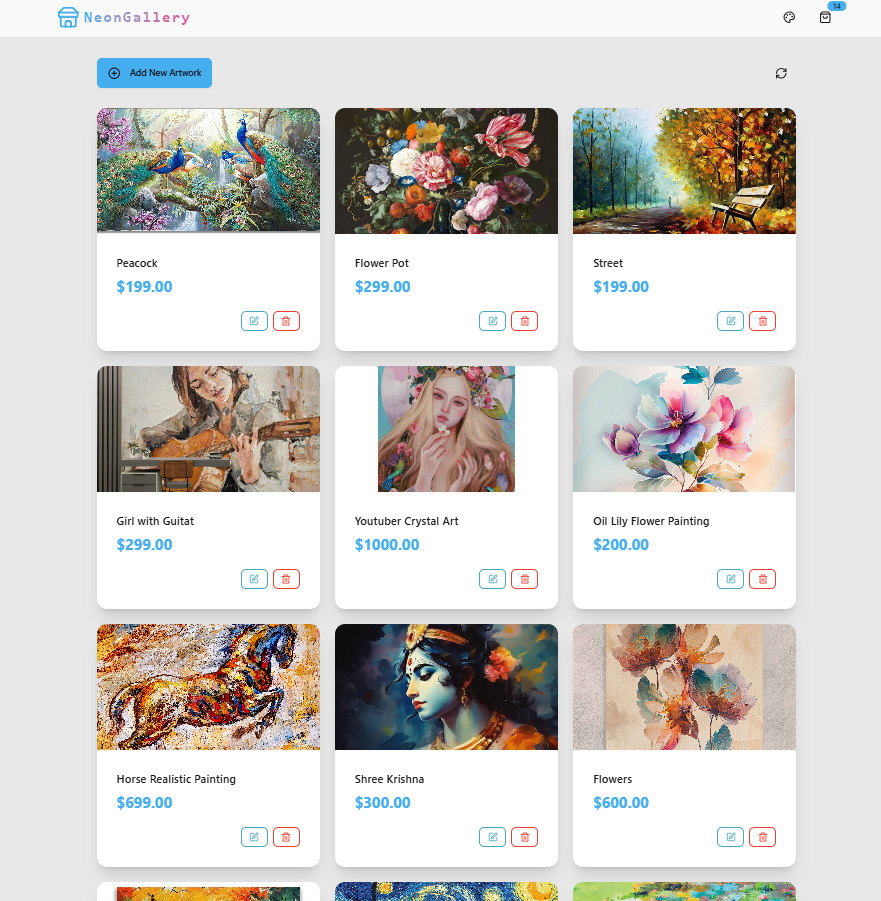

# 🎨 NeonGallery

A full-stack gallery manager with dynamic themes, secure CRUD operations, and real-time updates. Built for creators who value aesthetics and security.

## ✨ Features

- 🖼️ **Image & Metadata Management**: Upload, name, price, and curate artworks/products.
- 🎭 **13 DaisyUI Themes**: Switch UI themes instantly for personalized galleries.
- 🔒 **Security Layers**: Arcjet (bot detection + rate limiting) + Helmet for server-side protection.
- 🌟 **React Hot Toast**: Beautiful notifications for CRUD operations.
- 🚀 **Zustand State Management**: Efficient global state handling.

## 🛠 Tech Stack

- **Frontend**: React, DaisyUI, Lucide React Icons  
- **Backend**: Axios, Express.js  
- **Database**: Neon (Serverless Postgres)  
- **Security**: Arcjet, Helmet  
- **Tools**: React Hot Toast, Zustand  

## 📸 Screenshots

## 🤝 Contributing
Feel free to contribute! Fork the repo, make your changes, and submit a pull request.

  
  

🔥 Built with ❤️ by [Chetan Majumdar](https://github.com/ChetanTheCoder)

